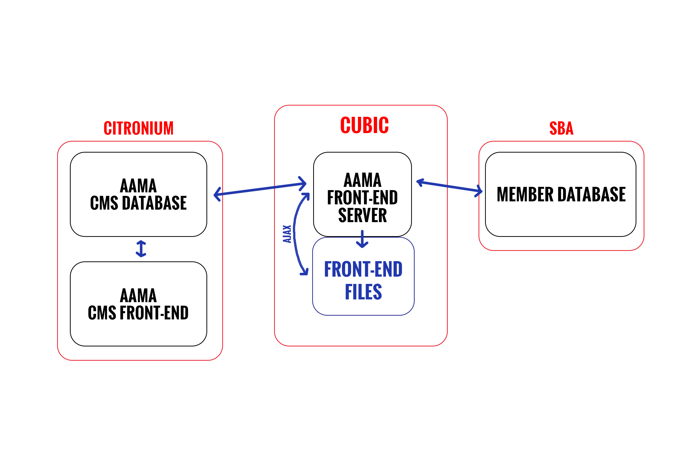

# AAMA Front End

This is a node project that deliver's AAMA's front-end for the website. It brings together the CMS and the SBA membership service.

# Member Authentication

The login route authenticates the user and gets the user object. This is saved both to the session and as a serialized cookie. The front-end should deliver the same files to logged in and non-logged in users. However the front-end javascript should check the user cookie to decide what to actually show. All user-initiated requests should go through the /ajax route. This route should check the user session, as the cookie can be tampered with.